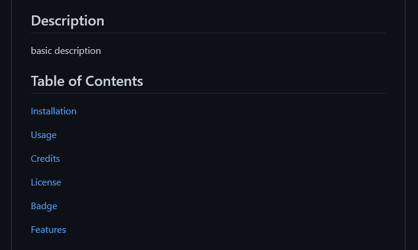

      
# Readme Generator
      

      
## By: David Whipple
      

      
## GitHub Username: D-Whipp
      

      
## Screenshot
      

      

      

      
## Description
      

      
Using JavaScript, Inquirer, and FS this code creates a Readme for Your coding Projects
      

      
## Table of Contents
      

      
- [Installation](#installation)   
- [Usage](#usage)    
- [Credits](#credits)    
- [License](#license)    
- [Badge](#badge)    
- [Features](#features)
- [Author](#author)
      

      
## Installation
      

      
Clone source code
      

      
## Usage
      

      
Use your favorite IDE to open the root directory, in the terminal type node index and you answer the prompts
      

      
## Credits
      

      
N/A
      

      
## License
      
MIT License

Copyright (c) [2022] [David Whipple]

Permission is hereby granted, free of charge, to any person obtaining a copy of this software and associated documentation files (the "Software"), to deal in the Software without restriction, including without limitation the rights to use, copy, modify, merge, publish, distribute, sublicense, and/or sell copies of the Software, and to permit persons to whom the Software is furnished to do so, subject to the following conditions:

The above copyright notice and this permission notice shall be included in all copies or substantial portions of the Software.

THE SOFTWARE IS PROVIDED "AS IS", WITHOUT WARRANTY OF ANY KIND, EXPRESS OR IMPLIED, INCLUDING BUT NOT LIMITED TO THE WARRANTIES OF MERCHANTABILITY, FITNESS FOR A PARTICULAR PURPOSE AND NONINFRINGEMENT. IN NO EVENT SHALL THE AUTHORS OR COPYRIGHT HOLDERS BE LIABLE FOR ANY CLAIM, DAMAGES OR OTHER LIABILITY, WHETHER IN AN ACTION OF CONTRACT, TORT OR OTHERWISE, ARISING FROM, OUT OF OR IN CONNECTION WITH THE SOFTWARE OR THE USE OR OTHER DEALINGS IN THE SOFTWARE.
      
## Badge
      

      
## Features
      
Builds a Readme for your Coding Projects
      

      
## Contribute
      
N/A
     
      
## Author

Hello! My name is David. 
Email is dwhipp88@gmail.com.  
[LinkedIn](https://www.linkedin.com/in/david-w-079841213/)  
If you're interested in seeing more of my work then check out my [portfolio](http://mighty-brook-32674.herokuapp.com/) or you can view my [github](https://github.com/D-Whipp). 
      

      
©2021. All Rights Reserved.
    
